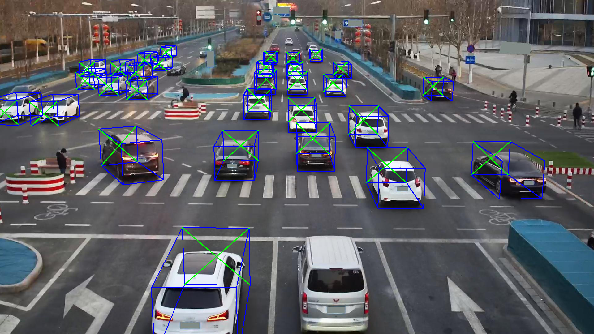
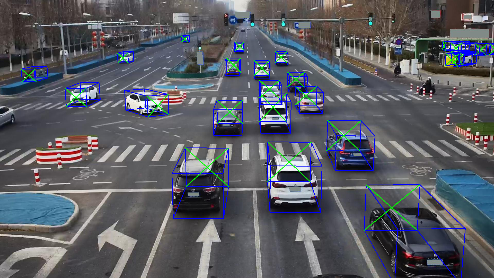

# RoadVision3D

**RoadVision3D** is a library tailored for 3D object detection from roadside infrastructure data. It enables users to train models on a wide variety of infrastructure-based datasets and perform inference for tasks like autonomous driving, traffic monitoring, and road safety analysis.

The library allows users to train on implemented datasets such as **DAIR-V2X**, **KITTI**, and **ROPE3D**, providing flexible pipelines for preprocessing, training, and evaluation.

<p align="center">
  
  
</p>

---

## Features

RoadVision3D provides implementations for the following 3D object detection models:

- MonoLSS: 

- GUPNet

- SMOKE

1. **Dedicated Dataset Support**:
   - **DAIR-V2X Infrastructure**: Focused on infrastructure scenarios for autonomous driving.
   - **KITTI**: Widely used benchmark for 3D object detection and tracking.
   - **ROPE3D**: Specialized for roadside infrastructure and object pose estimation in 3D.

2. **Custom Detection Framework**:
   - Intuitive modular components for preprocessing, training, inference, and evaluation.
   - Ease of implementing new datasets.

3. **Optimized Training Pipelines**:
   - Flexible configuration for customizing model architectures and hyperparameters.

4. **3D Visualization**:
   - Integrated tools to visualize 3D object detection results for performance analysis or presentations.

---

## Installation

### Step 1: Clone the Repository
```bash
git clone https://github.com/jborau/RoadVision3D.git
cd RoadVision3D
```

### Step 2: Set Up a Conda Environment
Create and activate a new Conda environment:
```bash
conda create --name roadvision3d python=3.8 -y
conda activate roadvision3d
```

### Step 3: Install PyTorch
Since PyTorch versions vary depending on CUDA support, install it manually following the instructions from [PyTorch’s official website](https://pytorch.org/get-started/locally/).

For example, if you're using **CUDA 11.8**, install PyTorch with:
```bash
pip install torch torchvision torchaudio --index-url https://download.pytorch.org/whl/cu118
```

For **CPU-only** installation:
```bash
pip install torch torchvision torchaudio
```

### Step 4: Install Required Dependencies
Once PyTorch is installed, install the other dependencies from `requirements.txt`:
```bash
pip install -r requirements.txt
```

### Step 5: Install RoadVision3D
Install the package in **editable mode** so changes in the source code reflect immediately:
```bash
pip install -e .
```

### Step 6: Verify Installation
Check if PyTorch is using the GPU:
```bash
python -c "import torch; print(torch.cuda.is_available())"
```

Check if RoadVision3D is correctly installed:
```bash
python -c "import roadvision3d"
```

---


## Usage

For detailed usage instructions, refer to the documentation:

Supported Datasets

[Training and Testing](docs/train_test.md)

Inference

Evaluation

Documentation comming soon...
---

## Citation

If you use RoadVision3D in your research, please cite it as follows:


```latex
@misc{roadvision3d,
   author = {Javier Borau Bernad},
   title = {RoadVision3D: A Library for 3D Object Detection from Roadside Infrastructure},
   year = {2025},
   howpublished = {\url{https://github.com/jborau/RoadVision3D}}
}
```
---

## License

[Apache 2.0 License](LICENSE)